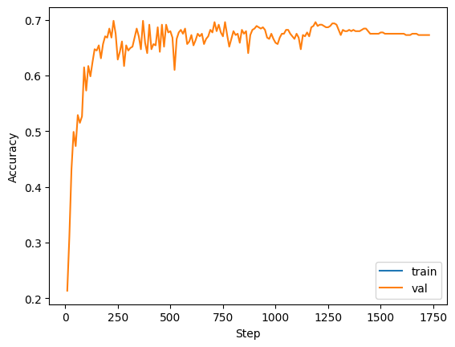
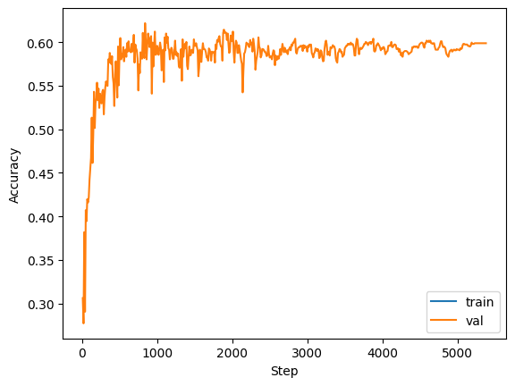

# Monday, November 20, 2023

### Improved sentence classification
Logic and impact classifiers improved: acheive close to 70% accuracy for logic classification and about 60% accuracy for impact classification. For balanced dataset and assessed on validation dataset. 

#### Logic
Balanced dataset contained 431 sentences for each of the 5 labels.

#### impact
Balanced dataset contained 1121 sentences for each of the 6 labels.

### Future plans:
